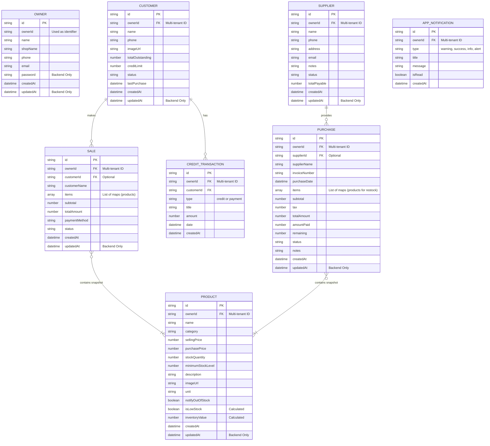

# 🛠️ ClickBuy: Entity-Relationship (ER) Diagram

This document contains the core Entity-Relationship (ER) data architecture for **ClickBuy**, a modern, full-stack application designed to streamline inventory management, sales tracking, and customer credit.

The diagram is written in Mermaid syntax and reflects the exact domain models used across both the ClickBuy backend (MongoDB Atlas) and frontend (Flutter).

## 📋 Architectural Notes

- **NoSQL Document Structure (MongoDB):** Since ClickBuy utilizes a MongoDB Atlas document database via Mongoose, relationships like `SALE <-> PRODUCT` or `PURCHASE <-> PRODUCT` are handled by embedding arrays of item snapshots rather than using strict foreign-key join tables. This guarantees historical invoice integrity and simplifies schema evolution.
- **Media Management (Cloudinary):** Product images are hosted externally on Cloudinary. The system persists only the secure URLs, while automated backend hooks manage the file lifecycle (delete/update) in sync with MongoDB records.
- **Authentication Layer (Firebase Phone OTP):** The primary entry point for Owners is Firebase Phone Authentication. The `phone` field in the `OWNER` entity serves as the unique identifier for account mapping across Firebase and Atlas.
- **Multi-tenant Core:** Every document is strictly scoped using an `ownerId` field, ensuring 100% data isolation between different shop owners across the Atlas cluster.
- **Calculated Fields (Frontend UI):** Several fields such as `Product.isLowStock` and `Product.inventoryValue` are dynamically provided via getters by the backend or evaluated globally to assist the frontend UI representation directly.
- **Customer & Supplier Relations:** A 1-to-Many relationship binds the customer profile to their checkout `SALE` records and `CREDIT_TRANSACTION` logs. Suppliers share a similar association tracing back through `PURCHASE` records.

---
*Architectural Document - ClickBuy Beta Environment.*
