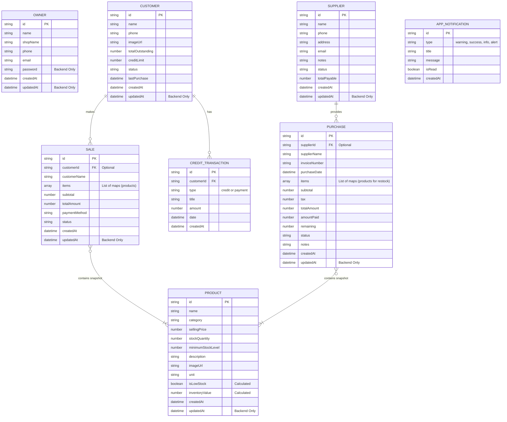

# 🛠️ ClickBuy: Entity-Relationship (ER) Diagram

This document contains the core Entity-Relationship (ER) data architecture for **ClickBuy**, a modern, full-stack application designed to streamline inventory management, sales tracking, and customer credit.

The diagram is written in Mermaid syntax and reflects the exact domain models used across both the ClickBuy backend (Firestore) and frontend (Flutter).

## 📋 Architectural Notes

- **NoSQL Document Structure:** Since ClickBuy utilizes a Firestore-like document database, relationships like `SALE <-> PRODUCT` or `PURCHASE <-> PRODUCT` are handled by embedding arrays of item snapshots rather than using strict foreign-key join tables. This guarantees historical invoice integrity if product prices or names change later.
- **Calculated Fields (Frontend UI):** Several fields such as `Product.isLowStock` and `Product.inventoryValue` are dynamically provided via getters by the backend or evaluated globally to assist the frontend UI representation directly.
- **Backend vs Frontend Models:** The `updatedAt` field acts generally as an internal backend timestamp hook for syncing, while it is primarily omitted in the dart-level app state models for simplicity.
- **Customer & Supplier Relations:** A 1-to-Many relationship binds the customer profile to their checkout `SALE` records and `CREDIT_TRANSACTION` logs. Suppliers share a similar association tracing back through `PURCHASE` records.

---
*Architectural Document - ClickBuy Beta Environment.*
